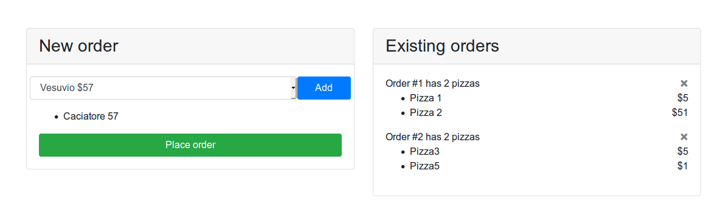

# Assignment 8

## Links

[Marios pizza assignment](https://github.com/datsoftlyngby/soft2019spring-test/blob/master/Assignments/06%20TDD%20assignment.pdf)
[Marios web ui system testing(this)](https://github.com/datsoftlyngby/soft2019spring-test/blob/master/Slides/08%20Functional%20testing.pdf)

## Info

The project is implemented in javascript. I do **not** expect you to run this. See next section for relevant parts and if you for some reason want to run it, see section "Building".


## Implementation

This is how the web interface looks like.



Left panel is used for creating a new order by selecting pizzas and "Add"-ing them, and then placing an order with "Place order". The right panel shows all current orders and the pizzas in them. It also has the option to remove the order by clicking the "X" icon.

The source code for the selenium tests can be found in [tests/seleniumtests.js](tests/seleniumtests.js) file. While the syntax is a bit different from Java, I think you should be able to figure out the "webdriver"(selenium) parts. There are three tests, each coresponding to a user story from the Marios pizza bar assignment. Each test case is contained in a separate "it" block(that's how you define test cases with mocha(lib)).

The output from running the tests is shown below, but all tests are passing.
```

> assignment-8-js@0.0.0 test:selenium /mnt/shared/CphBusiness/soft2019spring-test/Assignments/assignment_8_js
> PATH=$PATH:./drivers node node_modules/mocha/bin/mocha --timeout 30000 tests


  ✓ Enter order (1245ms)
  ✓ Can see orders
  ✓ Order is deleted (147ms)

  3 passing (9s)
```

## Building

I provide no instructions for Windows and the Linux-ish instructions below may need to be tweaked to work for you.

I assume you have `node.js` installed in your system.

Install dependencies:
```
npm install
```

At this point you should be able to run the web interface by typing
```
npm run start
```

### Running the tests

Download the firefox geckodriver for selenium webdriver(if you want to use chrome, you will also need to change the `tests/seleniumtests.js` file). Ensure that driver is found using your `$PATH` variable **OR** place it in a folder called `drivers` in the current directory.

If nothing went wrong(I'm sure it did), you can run the tests with:
```
npm run test:selenium
```